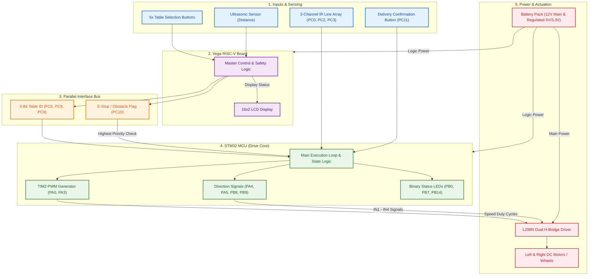
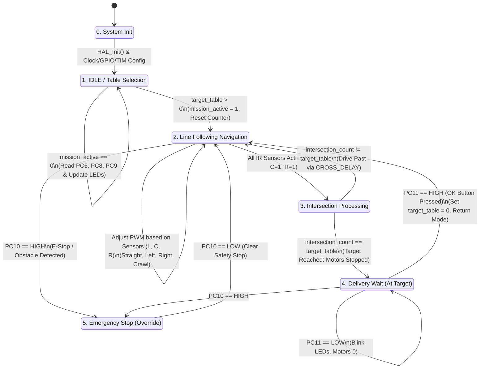

```mermaid
flowchart TD
    %% Custom Color Styles
    classDef inputStyle fill:#E3F2FD,stroke:#1565C0,stroke-width:2px,color:#0D47A1;
    classDef vegaStyle fill:#F3E5F5,stroke:#7B1FA2,stroke-width:2px,color:#4A148C;
    classDef interStyle fill:#FFF3E0,stroke:#EF6C00,stroke-width:2px,color:#E65100;
    classDef stmStyle fill:#E8F5E9,stroke:#2E7D32,stroke-width:2px,color:#1B5E20;
    classDef actStyle fill:#FFEBEE,stroke:#C62828,stroke-width:2px,color:#B71C1C;

    subgraph User_Interface ["1. Inputs & Sensing"]
        B1["5x Table Selection Buttons"]:::inputStyle
        US["Ultrasonic Sensor (Distance)"]:::inputStyle
        IR["3-Channel IR Line Array (PC0, PC2, PC3)"]:::inputStyle
        ACK["Delivery Confirmation Button (PC11)"]:::inputStyle
    end

    subgraph Vega_Controller ["2. Vega RISC-V Board"]
        V_PROC["Master Control & Safety Logic"]:::vegaStyle
        LCD["16x2 LCD Display"]:::vegaStyle
    end

    subgraph Inter_Board ["3. Parallel Interface Bus"]
        P_BUS["3-Bit Table ID (PC6, PC8, PC9)"]:::interStyle
        STOP_LINE["E-Stop / Obstacle Flag (PC10)"]:::interStyle
    end

    subgraph STM32_Controller ["4. STM32 MCU (Drive Core)"]
        FSM["Main Execution Loop & State Logic"]:::stmStyle
        TIM2["TIM2 PWM Generator (PA0, PA3)"]:::stmStyle
        GPIO_DIR["Direction Signals (PA4, PA5, PB8, PB9)"]:::stmStyle
        LEDs["Binary Status LEDs (PB0, PB7, PB14)"]:::stmStyle
    end

    subgraph Actuation ["5. Power & Actuation"]
        L298N["L298N Dual H-Bridge Driver"]:::actStyle
        MOTORS["Left & Right DC Motors / Wheels"]:::actStyle
        PWR["Battery Pack (12V Main & Regulated 5V/3.3V)"]:::actStyle
    end

    %% Wiring Connections
    B1 --> V_PROC
    US --> V_PROC
    V_PROC -->|Display Status| LCD
    V_PROC --> P_BUS
    V_PROC --> STOP_LINE

    P_BUS --> FSM
    STOP_LINE -->|Highest Priority Check| FSM
    IR --> FSM
    ACK --> FSM

    FSM --> LEDs
    FSM --> TIM2
    FSM --> GPIO_DIR

    TIM2 -->|Speed Duty Cycles| L298N
    GPIO_DIR -->|IN1 - IN4 Signals| L298N
    PWR -->|Main Power| L298N
    PWR -->|Logic Power| Vega_Controller
    PWR -->|Logic Power| STM32_Controller
    L298N --> MOTORS
```

```mermaid
stateDiagram-v2
    classDef stateInit fill:#ECEFF1,stroke:#455A64,stroke-width:2px,color:#263238;
    classDef stateIdle fill:#FFF8E1,stroke:#FFA000,stroke-width:2px,color:#FF6F00;
    classDef stateNav fill:#E8F5E9,stroke:#388E3C,stroke-width:2px,color:#1B5E20;
    classDef stateInter fill:#E3F2FD,stroke:#1976D2,stroke-width:2px,color:#0D47A1;
    classDef stateWait fill:#F3E5F5,stroke:#8E24AA,stroke-width:2px,color:#4A148C;
    classDef stateStop fill:#FFEBEE,stroke:#D32F2F,stroke-width:2px,color:#B71C1C;

    [*] --> SYSTEM_INIT
    
    state "0. System Init" as SYSTEM_INIT ::: stateInit
    state "1. IDLE / Table Selection" as IDLE_STATE ::: stateIdle
    state "2. Line Following Navigation" as NAV_STATE ::: stateNav
    state "3. Intersection Processing" as INTER_STATE ::: stateInter
    state "4. Delivery Wait (At Target)" as WAIT_STATE ::: stateWait
    state "5. Emergency Stop (Override)" as ESTOP_STATE ::: stateStop

    SYSTEM_INIT --> IDLE_STATE : HAL_Init() & Clock/GPIO/TIM Config

    IDLE_STATE --> IDLE_STATE : mission_active == 0\n(Read PC6, PC8, PC9 & Update LEDs)
    IDLE_STATE --> NAV_STATE : target_table > 0\n(mission_active = 1, Reset Counter)

    NAV_STATE --> ESTOP_STATE : PC10 == HIGH\n(E-Stop / Obstacle Detected)
    NAV_STATE --> NAV_STATE : Adjust PWM based on Sensors (L, C, R)\n(Straight, Left, Right, Crawl)
    NAV_STATE --> INTER_STATE : All IR Sensors Active (L=1, C=1, R=1)

    INTER_STATE --> WAIT_STATE : intersection_count == target_table\n(Target Reached: Motors Stopped)
    INTER_STATE --> NAV_STATE : intersection_count != target_table\n(Drive Past via CROSS_DELAY)

    WAIT_STATE --> WAIT_STATE : PC11 == LOW\n(Blink LEDs, Motors 0)
    WAIT_STATE --> NAV_STATE : PC11 == HIGH (OK Button Pressed)\n(Set target_table = 0, Return Mode)
    WAIT_STATE --> ESTOP_STATE : PC10 == HIGH

    ESTOP_STATE --> NAV_STATE : PC10 == LOW (Clear Safety Stop)
```
